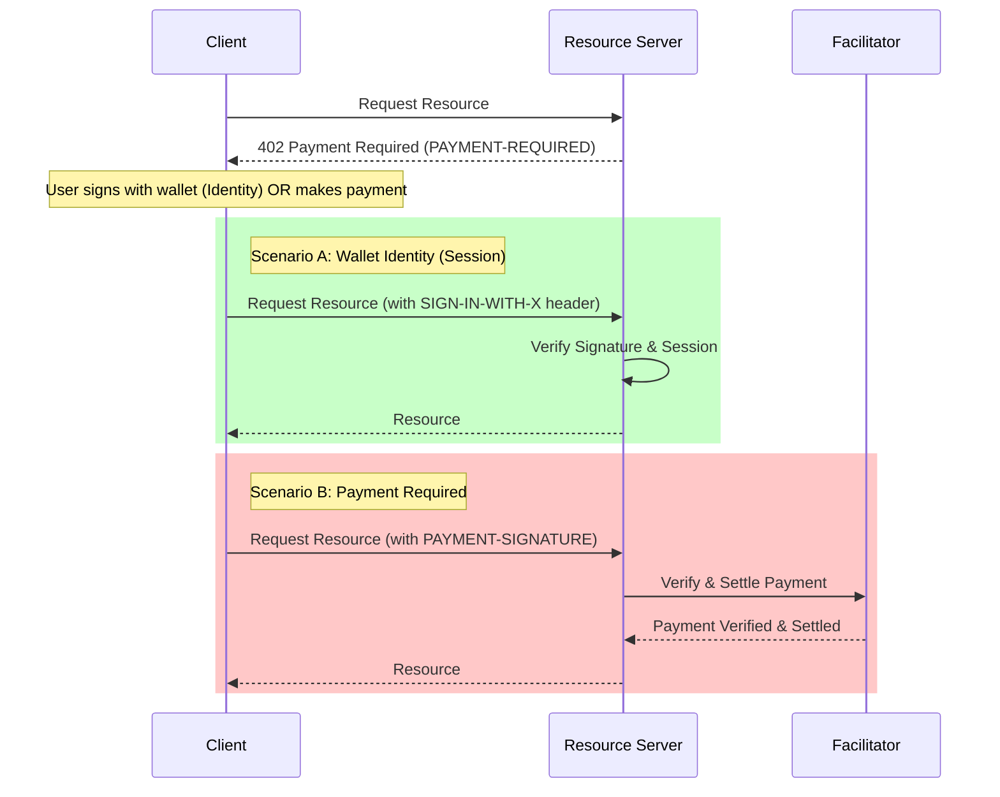

# NodePay x402-Compatible Architecture

This document outlines a new, simplified architecture for NodePay that is compatible with the x402 v2 protocol. This architecture aims to streamline the payment process, reduce the number of API calls, and leverage the power of wallet-based identity and off-chain payments.

## Core Concepts

The x402-compatible architecture is based on the following core concepts:

*   **x402 Protocol:** All payments are initiated and processed using the x402 v2 protocol. This means that instead of the complex multi-step process of creating a `PaymentIntent`, then a `PaymentOption`, and then polling for status, the payment is handled in a single HTTP request/response cycle.
*   **Facilitator:** A new component, the "Facilitator", is introduced. The Facilitator is responsible for handling the complexities of the x402 protocol, such as payment verification, and settlement. The NodePay API server acts as a resource server, and the Facilitator acts as a payment gateway.
*   **Wallet-based Identity:** Users are identified by their wallet address using the `SIGN-IN-WITH-X` header. This allows for reusable sessions and access control tokens, reducing the need for repeated payments for every single request.
*   **Discovery:** The service exposes a compliant discovery endpoint (e.g., `/.well-known/x402-discovery` or `/v1/discovery`) that allows x402 facilitators to automatically index available resources, pricing, and settlement options.
*   **Simplified Data Models:** The data models are simplified. The `PaymentIntent` is replaced by a simpler `Charge` object, which represents a single payment request. The `PaymentOption` is eliminated altogether.

## Component Responsibilities

### Resource Server (Merchant)

*   **Resource Management:** Manages the resources that require payment.
*   **Payment Requirement:** Responds with a `402 Payment Required` status code and a `PAYMENT-REQUIRED` header when a resource requires payment.
*   **Payment Verification:** Verifies the payment with the Facilitator.
*   **Resource Delivery:** Delivers the resource to the client after successful payment verification.
*   **Settlement Configuration:** Provides an interface for merchants to configure their settlement rules.

### Facilitator

*   **x402 Protocol Implementation:** Implements the x402 v2 protocol.
*   **Payment Verification:** Verifies the payment on the blockchain.
*   **Settlement Execution:** Executes the settlement based on the merchant's settlement rules.
*   **Discovery Service:** Crawls and indexes the Resource Server's metadata to automatically configure payment routing and UI.

## Payment Flow

The new payment flow is as follows:

1.  **Request Resource:** The client requests a resource from the Resource Server.
2.  **Payment Required:** The Resource Server determines that payment is required and responds to the client with a `402 Payment Required` status code and a `PAYMENT-REQUIRED` header, containing the payment details (constructed via the NodePay SDK).
3.  **Make Payment:** The user pays using the information from the `PAYMENT-REQUIRED` header.
4.  **Request Resource Again:** The client requests the resource again with the payment proof (`Payment-Signature` or `Sign-In-With-X`).
5.  **Verify Payment and Return Resource:** The Resource Server verifies the payment with the Facilitator. If the payment is valid and settled, the server returns the resource to the client.



## Data Model Mapping

The new data models are designed to be simpler and more focused on the x402 flow. Here's how the old data models map to the new ones:

| Old Data Model | New Data Model | Notes |
| :--- | :--- | :--- |
| `PaymentIntent` | `Charge` | The `Charge` object is a simplified version of the `PaymentIntent`, containing only the essential information for a single payment. |
| `PaymentMethod` | (eliminated) | The concept of `PaymentMethod` is handled by the user's wallet and the Facilitator. |
| `PaymentOption` | (eliminated) | The `PaymentOption` is no longer needed, as the payment is handled in a single step. |
| `Quote` | `Charge` | The quoting functionality is integrated into the `Charge` creation process. |
| `SettlementConfig` / `SettlementRule` | `SettlementRule` | A simplified `SettlementRule` object is used to define the settlement rules. |
| `Transaction` | (internal to Facilitator) | Transaction details are handled internally by the Facilitator. |
| `Refund` | `Refund` | The `Refund` object remains, but is now associated with a `Charge`. |
| `CheckoutSession` | (eliminated) | The hosted checkout functionality can be built on top of the new API, but is not part of the core protocol. |

## Settlement

Settlement is handled by the Facilitator based on the merchant's settlement rules. The settlement rules are configured on the NodePay API Server and are passed to the Facilitator when a `Charge` is created.

The settlement process is as follows:

1.  **Configure Settlement Rules:** The merchant configures their settlement rules on the NodePay API Server. This includes specifying the settlement asset, network, and address.
2.  **Create Charge:** When a `Charge` is created, the settlement rules are passed to the Facilitator.
3.  **Execute Settlement:** After a successful payment, the Facilitator executes the settlement based on the settlement rules. This may involve swapping the payment asset for the settlement asset and transferring the funds to the merchant's settlement address.

## Webhooks

The Facilitator sends webhooks to the merchant's backend to notify them of payment events. The following webhook events are supported:

*   `charge.paid`: Sent when a charge is successfully paid.
*   `charge.failed`: Sent when a charge fails.
*   `charge.expired`: Sent when a charge expires.
*   `refund.created`: Sent when a refund is created.
*   `refund.succeeded`: Sent when a refund is successful.
*   `refund.failed`: Sent when a refund fails.

The webhook payload contains the full `Charge` or `Refund` object.

## API Mapping

The new API is designed to be simpler and more consistent with the x402 protocol. Here's how the old API endpoints map to the new ones:

| Old API Endpoint | New API Endpoint | Notes |
| :--- | :--- | :--- |
| `POST /v1/payment_intents` | `POST /v1/charges` | Creates a `Charge` instead of a `PaymentIntent`. |
| `GET /v1/payment_intents/{id}` | `GET /v1/charges/{id}` | Retrieves a `Charge` instead of a `PaymentIntent`. |
| `POST /v1/payment_intents/{id}/payment_options` | (eliminated) | The payment is now handled in a single step. |
| `POST /v1/checkout/sessions` | (eliminated) | The hosted checkout functionality is not part of the core protocol. |
| `POST /v1/refunds` | `POST /v1/refunds` | The refund API remains, but is now associated with a `Charge`. |
| `/.well-known/x402-discovery` | `GET /v1/discovery` | New endpoint for x402 V2 automatic discovery of service metadata. |

### Headers

x402 V2 relies heavily on HTTP headers:

*   `PAYMENT-REQUIRED`: Sent by the server in 402 responses, containing payment details.
*   `SIGN-IN-WITH-X`: Sent by the client to prove identity and access a session without repurchasing (if eligible).
*   `PAYMENT-SIGNATURE`: (Optional) Sent by the client to prove a specific payment transaction was broadcast.

## Error Handling

Error handling is simplified in the new architecture. The API uses standard HTTP status codes to indicate the outcome of a request. The error response body contains a machine-readable error code and a human-readable error message.

Refer to the `spec/errors.yaml` file for a complete list of error codes.

## Simplified Specification

The new specification will be defined in the following files:

*   `spec/charges.yaml`: Defines the internal `Charge` object (Database model).
*   `spec/x402_protocol.yaml`: Defines the **Wire Protocol** (`PaymentRequired`, `PaymentPayload`) used in 402 exchanges.
*   `spec/facilitator.yaml`: Defines the Facilitator's API for verifying (`/v1/verify`), settling (`/v1/settle`), and discovery (`/v1/supported`).
*   `spec/errors.yaml`: Defines the error codes.
*   `spec/discovery.yaml`: Defines the discovery endpoint for facilitator auto-configuration.
*   `spec/webhooks.yaml`: Defines the structure of webhook events (`charge.paid`, `refund.failed`, etc.).

## Wallet-based Identity (x402 V2)

To reduce friction, NodePay supports the `SIGN-IN-WITH-X` header.

1.  **Challenge:** When a client first requests a resource, the server responds with 402. The response header may include a challenge or session nonce.
2.  **Sign:** The user signs the challenge/nonce with their wallet.
3.  **Access:** The client includes the `SIGN-IN-WITH-X` header with the signature in subsequent requests.
4.  **Verify:** The server verifies the signature. If the wallet has a valid active session (e.g., from a previous payment or subscription), access is granted immediately, skipping the 402 flow.

## Service Discovery

NodePay implements the x402 Discovery extension.

*   **Endpoint:** `/v1/discovery` (or `/.well-known/x402-discovery`)
*   **Purpose:** Exposes, machine-readable metadata about the service.
*   **Content:**
    *   Supported chains and assets (USDC on Base, ETH on Mainnet, etc.)
    *   Pricing rules (e.g., "1 USDC per request")
    *   Facilitator preferences
    *   Settlement constraints

This allows any x402-compatible wallet or agent to automatically "read" the store's requirements and configure the payment transaction without manual developer integration.

## Integration Guide

This guide describes how to integrate NodePay into your application using our SDKs. For detailed SDK specifications, see [spec/sdk.md](spec/sdk.md).

### 1. Server Integration (Node.js/Express)

Install the facilitator SDK (if applicable) or backend:

```bash
# Example for running the facilitator
cd facilitator
go run cmd/api/main.go
```

Add the middleware to your API:

```javascript
const express = require('express');
const { nodepay } = require('@nodepay/facilitator');

const app = express();

// 1. Configure NodePay
const paywall = nodepay({
  apiKey: process.env.NODEPAY_API_KEY,
  settlement: {
    address: '0x1234567890abcdef1234567890abcdef12345678', // Your wallet address
    network: 'base', // Optional: defaults to base
    asset: 'USDC' // Optional: defaults to USDC
  },
  facilitator: { url: 'https://api.facilitator.com' } // URL of your Facilitator instance
});

// 2. Protect Routes
// Basic usage: Require $0.05 USD for this endpoint
app.get('/api/premium-data', 
  paywall.requirePayment({ amount: '0.05', currency: 'USD' }), 
  (req, res) => {
    res.json({ secret: 'Standard x402 content' });
  }
);

// 3. Enable Discovery (Optional but recommended)
app.use(paywall.discovery());

app.listen(3000);
```

### 2. Client Integration (Browser/Agent)

Install the client SDK:

```bash
npm install @nodepay/client
```

Fetch protected resources:

```javascript
import { NodepayClient } from '@nodepay/client';

// 1. Initialize Client
// In browser, it can automatically interpret window.ethereum
const client = new NodepayClient({
  wallet: window.ethereum 
});

async function getData() {
  try {
    // 2. Make Request
    // The client automatically handles 402 responses, 
    // prompts the user to sign/pay, and retries.
    const res = await client.fetch('https://api.yoursite.com/api/premium-data');
    
    const data = await res.json();
    console.log(data);
  } catch (error) {
    console.error("Payment failed or rejected", error);
  }
}
```

### 3. Running the End-to-End Demo

The repository includes a complete example set to demonstrate the full flow.

#### Prerequisites
- Go 1.21+
- Node.js & npm
- A browser with Metamask installed

#### Step 1: Start the Facilitator
The Facilitator acts as the payment processor and verification oracle.
```bash
cd facilitator
go run cmd/api/main.go
# Server listens on :8080
```

#### Step 2: Start the Merchant Server (Example)
The Merchant server sells a digital widget and enforces payment using the x402 protocol.
```bash
cd examples/server
go run cmd/main.go
# Server listens on :8081
```

#### Step 3: Start the Client App (Example)
The Client app connects to your wallet and handles the purchase flow.
```bash
cd examples/client
npm install
npm run dev
# App runs on http://localhost:5173
```

**Demo Flow:**
1. Open the Client App URL.
2. Click **Buy Now**.
3. Accept the signature request in Metamask (Mocked mode uses 0-value tx or signature).
4. See the successful purchase alert and the "premium" data returned.

This new architecture significantly simplifies the payment process for both merchants and users, while also providing a more flexible and extensible platform for future development.
